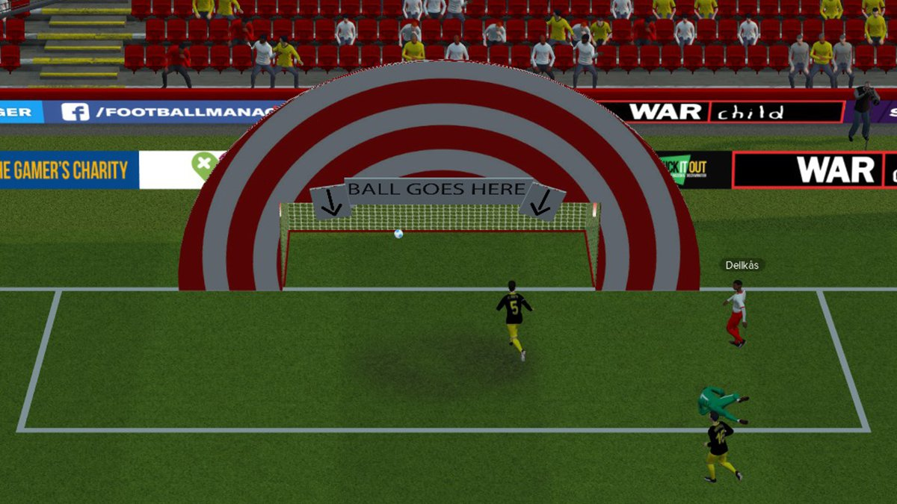
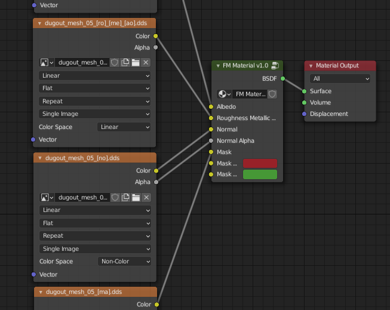

# Football Manager Tools
Blender addon for Football Managers mesh format.

Imported | Exported
------------ | -------------
|

# Usage
1. Open Football Manager 2024 Resource Archiver(comes with the game on steam).
2. Extract simatchviewer and simatchviewer-pc to a folder.
> simatchviewer is models, simatchviewer-pc is textures
3. Download the latest zip from [releases](https://github.com/Stromberg90/football-manager-tools/releases).
4. Open Blender.
5. Go to Edit->Preferences->Addons then the install button on the upper right corner and select the zip you downloaded.
6. Enable addon, set **Base Extracted Textures** to the simatchviewer-pc folder you extracted earlier(to automatically assign textures).
7. Enabled addon and there should now be a **Football Manager 2024 Mesh (.sia)** entry under the import and export menu.

# Custom Textures
_For lightmaps it seens like it also reads the filepath from the associated .jsb file, so it has to match what's in that file_

Download DDS Utilities from https://developer.nvidia.com/gameworksdownload#?dn=dds-utilities-8-31, or another way of creating dds files with
different compression.
- Albedo
    - suffix: [al]
    - compression: DXT1
    - blender color space: sRGB
- Normal Map
    - suffix: [no]
    - compression: DXT5NM
    - command example: `nvdxt.exe -file "path" -dxt5nm`
    - blender color space: Non-Color
- Mask
    - suffix: [ma]
    - compression: DXT1
    - blender color space: Linear
- Roughness, Metalic, Ambient Occlusion **combined texture**
    - suffix: [ro]\_[me]_[ao]
    - compression: DXT5
    - blender color space: Linear
- Lightmap
    - suffix: [lm]
    - compression: DXT1
    - blender color space: Linear      

Import the FM Material node group and use that to assign your textures too, exporting the textures will not work without it.

# Limitations
## Import
- Meshes that have instances have very basic support.
## Export
- Instances is not supported.
- Multiple materials on the same mesh, so for now separate them before exporting.

# Contributing
Help is appreciated in anyway, however here is some examples.
- Testing on other versions of football manager
- There are parts of the sia format that I've yet to figure out.
- I've not looked into the animation format, but that is needed to add custom animations.
- .simat looks to be a json like config format for materials.
- Shaders I've had a look at, but I wonder if they need to be compiled.
- .jsb files
