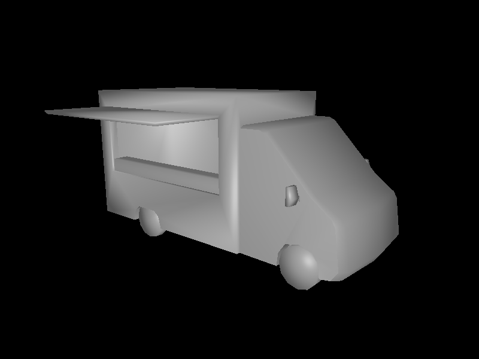
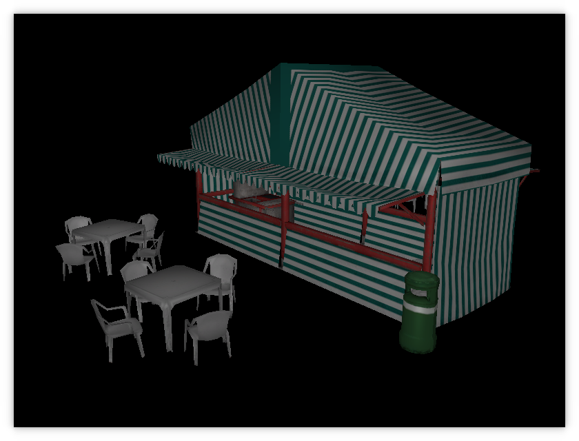

# Football Manager Tools

Set of tools for working with Football Managers 3D mesh format(.sia)

#### Tools:
- Blender Addons
	- Import .sia
	- Export .sia
- Rust crate for parsing .sia files
- #### Standalone Mesh(.sia) Viewer

Mesh             |  Wireframe
:-------------------------:|:-------------------------:
|  

Textured

Ball replaced with burger mesh exported from blender.

Boardroom mesh from football manager rendered in blender.

#### Notes
- Only tested on Football Manager 2021
- Blender import is not functional

#### Usage
1. Clone this repository
2. Install Football Manager 2021
3. Install Football Manager 2021 Resource Archiver
4. Using the Resource Archiver extract whichever archives you want to look at, the meshes are in simatchviewer and textures in simatchviewer-pc
5. Working with the tools
	- Standalone Viewer
		1. Install the rust toolchain [rustup.rs](https://rustup.rs/)
		2. Switch to the nightly toolchain using rustup
		3. run `cargo run` inside the sia_viewer folder
		4. Program brings up a file dialog on startup, select a .sia file
		5. Hotkeys
			- Shift-W to toggle wireframe
			- Ctrl-S saves a obj with the mesh name in the folder next to the excecutable
	- Blender
		1. Open Blender
		2. Go to Edit->Preferences->Addons then the install button on the upper right corner and select the io_scene_sia folder
		3. Enabled addon and there should now be a `Football Manager 2021 Mesh (.sia)` entry under the import and export menu

#### Contributing
Help is appreciated in anyway, however here is some parts I've had on my mind.
- Testing on other versions of football manager
- There are several parts of the sia format that I've yet to figure out.
- I've not looked into the animation format, but that is needed to add custom animations.
- .simat looks to be a json like config format for materials.
- Shaders I've had a look at, but I wonder if they need to be compiled.
- .jsb files
