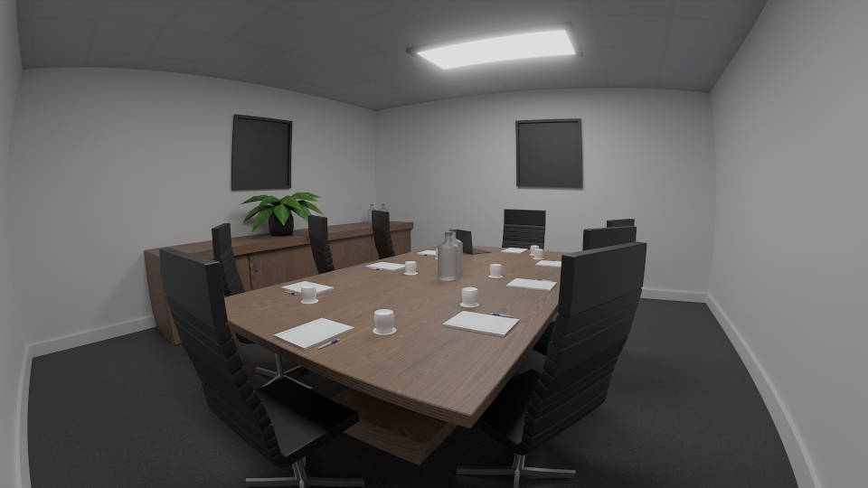

# Football Manager Tools

Blender addon for Football Managers 3D mesh format(.sia)

Boardroom mesh from football manager rendered in blender.

#### Notes
- Only tested on Football Manager 2021

Download DDS Utilities from https://developer.nvidia.com/gameworksdownload#?dn=dds-utilities-8-31, or another way of creating dds files with
different compression.
- Normal Maps [no] with DXT5NM compression, nvdxt command line example. 
nvdxt.exe -file "path" -dxt5nm
- Albedo maps [al], DXT1 compression.
- Roughness, Metalic, Ambient Occlusion Map [ro]_[me]_[ao] - DXT5 

#### Usage
1. Open Blender
2. Go to Edit->Preferences->Addons then the install button on the upper right corner and select the io_scene_sia folder or zip if you downloaded it.
3. Enabled addon and there should now be a `Football Manager 2021 Mesh (.sia)` entry under the import and export menu.

#### Contributing
Help is appreciated in anyway, however here is some parts I've had on my mind.
- Testing on other versions of football manager
- There are several parts of the sia format that I've yet to figure out.
- I've not looked into the animation format, but that is needed to add custom animations.
- .simat looks to be a json like config format for materials.
- Shaders I've had a look at, but I wonder if they need to be compiled.
- .jsb files
